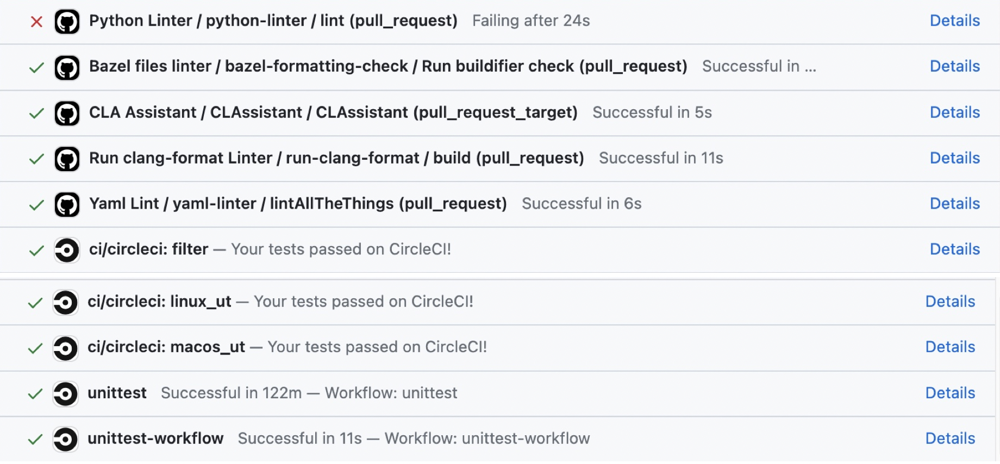
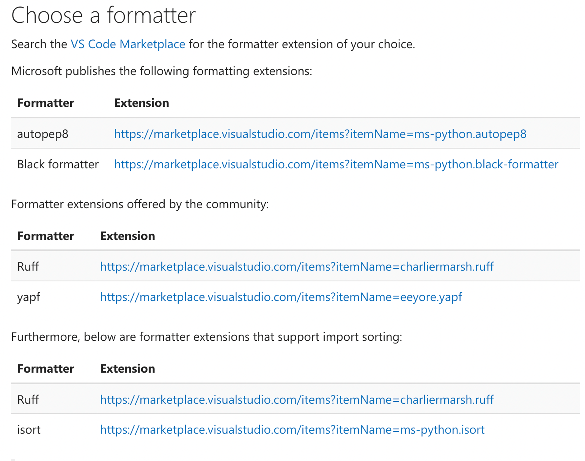
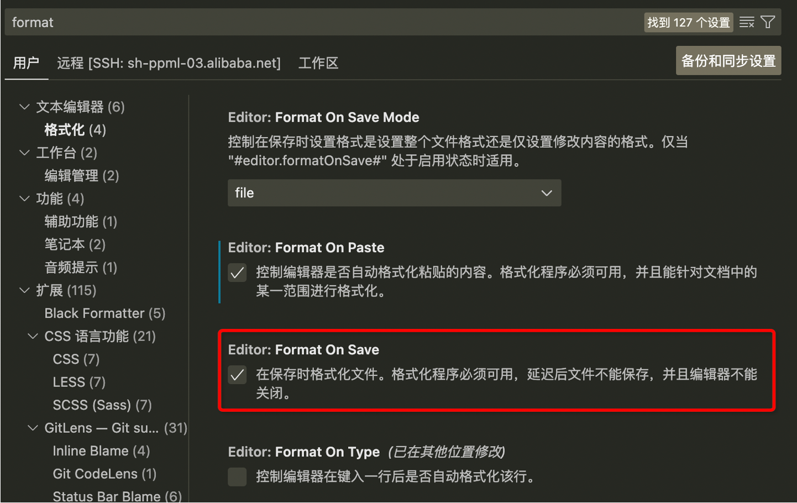

# Contribution guide
## Pull Request Checklist
在您提交pull requests之前，请确保您已经执行过以下几步检查
- 检查是否已经签署了CLA
- 功能性改变是否已通过RFC和社区负责同学沟通完成
- 是否对新加模块的增加了正确的unittest
- 线下单测是不是都能跑过
- 代码格式和规范是否都正确
## 如何成为Contributor并提交你自己的代码
1. 签署CLA
2. 提交规范代码
3. 提供对应的unittest，并保证新添加的单测和已有单测都通过
4. 申请code review
5. Pull request successfully merged and closed

## 签署CLA
CLA协议指的是“Contributor License Agreement”，即“贡献者许可协议”。这是开源项目经常使用的一种法律协议，它规定了贡献者如何以及在什么条件下向项目提交代码或文档等贡献。  
在您第一次为secretflow提交代码时，我们需要您签署CLA协议。  
签署的方式也很简单——在对话框中回复即可。
```
I have read the CLA Document and I hereby sign the CLA
```
**注意：请一定要确认输入和这段文字完全相同，如遇到失败，请刷新重试**
## 提交规范代码
如何提交代码可以参考github的howto文档。[howto](https://docs.github.com/en/pull-requests/collaborating-with-pull-requests/proposing-changes-to-your-work-with-pull-requests/about-pull-requests)  
因为在开源社区中需要开发们合作开发代码，所以代码的规范和统一的标准就很重要，可以实现代码的一致性，可读性和可维护性。  
当你为SecretFlow贡献新特性时，默认来说维护责任会转移给SecretFlow团队。这意味着我们在做code review必须权衡贡献给项目带来的好处和维护该特性的成本。建议您在开发新功能之前先通过提交`RFC`和我们讨论您的想法，再进行开发。
### 代码规范
为SecretFlow中提交python代码时，需要遵守[Google Python Style Guide](https://google.github.io/styleguide/pyguide.html).  
进一步：  
1. 命名需要有实际意义，以方便code review以及后期的维护。
2. 需要在代码中添加注释。
3. 对外暴露的接口需要按照google style添加`docstring`，docstring会在后续自动转为api文档方便用户学习阅读。
4. 注释需要使用英文。

### 格式化
我们使用Black和isort来对代码进行格式化，来保证每个开发者的格式一致性。  
以下的文档可以参考。
- [Black文档](https://black.readthedocs.io/en/stable/the_black_code_style/current_style.html): 在使用black进行格式化的时候需要加上`-S, --skip-string-normalization`.
- [isort文档](https://pycqa.github.io/isort/)
- [Format_in_VSCode](https://code.visualstudio.com/docs/python/formatting): 在IDE中配置正确的格式化插件可以提高开发效率。





**格式化Lint报错**
可以点击旁边的`Detail`查看具体的报错信息，可以根据报错信息进行代码格式调整。  

### 单测  
- 当您为SecretFlow贡献代码时，请务必包括单元测试，因为单元测试可以保证您提供的代码运行正常， 同时可以保证改动不影响其他模块功能。同时在未来进行破坏性修改的时候，可以保证模块正确性，降低维护成本。
- Bug修复也需要单元测试，因为Bug的存在通常表明测试覆盖率不足。  


SecretFlow中使用pytest来完成单测。[pytest文档](https://pytest.org/)

#### 其他要点

**Device**  
我们在代码中提供了阈值的device，包括`pyu`,`spu`,`heu`等，您在写单测的时候直接参考引用即可
https://github.com/secretflow/secretflow/blob/main/tests/conftest.py


**执行测试**  
在开发完成单测之后，需要在本地进行调试，单测验证通过后再进行提交。  
执行命令为`pytest --env prod/sim -n auto 路径`
```
# 执行一个单测文件
pytest --env sim -n auto  tests/ml/nn/sl/test_sl_model_tf.py # 模拟环境
# 执行一个目录下所有单测文件
pytest --env prod -n auto  tests/ml/nn/sl # 生产模式

```
**注意**
如果在单测调试中需要屏幕输出，请使用`logging.warning`，正常的屏幕输出会被pytest进行接管。

## 小结
1. 单测很重要，提交功能性代码一定要附上单测
2. 线下跑单测，按照报错提示进行修改
3. 使用logging.warning进行内容输出
4. 全部单测都可以通过，申请code review
